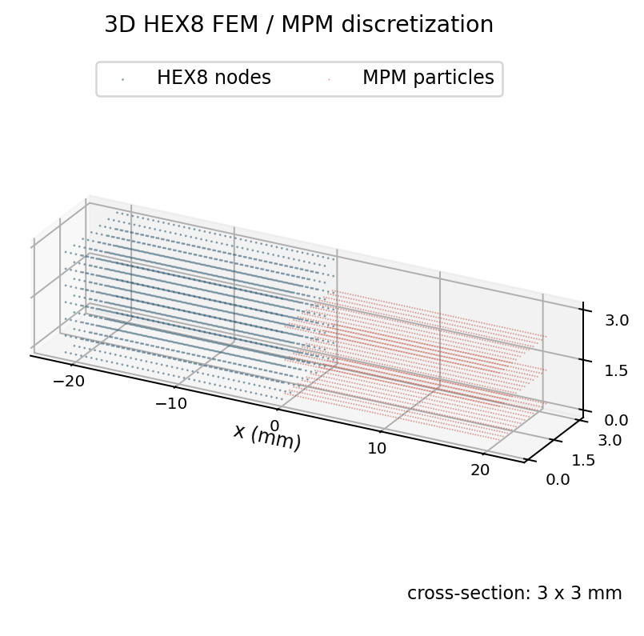
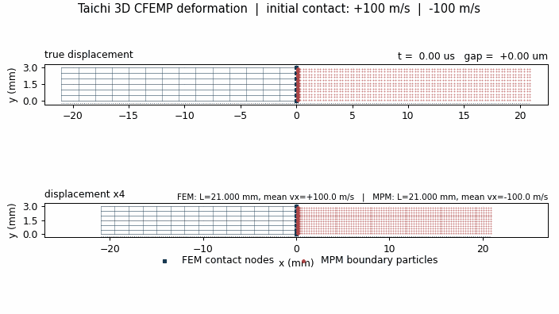
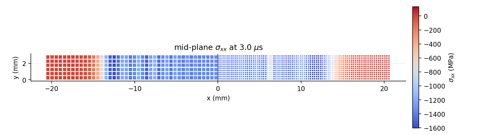
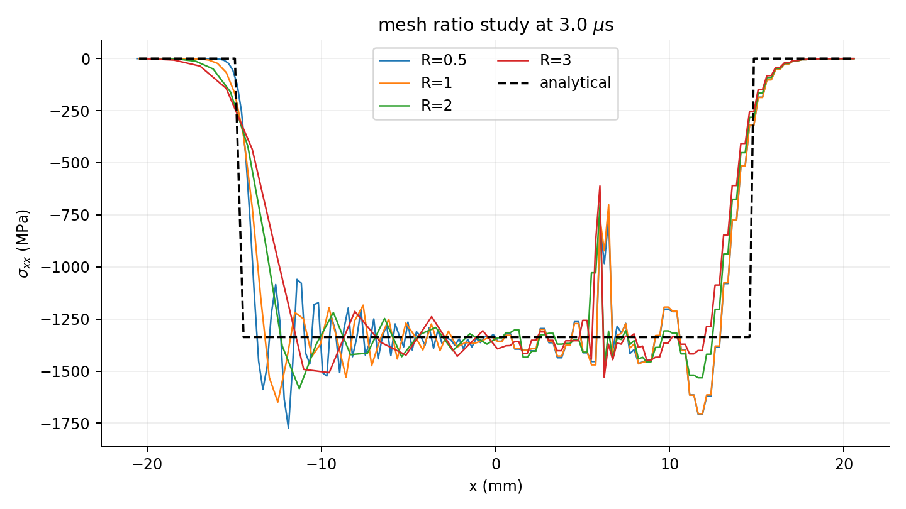

# CFEMP

Lian, Zhang & Liu (2011) 对称板碰撞的 Taichi 三维实现。

上传的 *A Coupled Finite Element Material Point Method for Large
Deformation Problems* 是 2018 年方法章节；这里的三维基准对应其参考文献 1
原始论文第 5.1 节。

左板是 HEX8 FEM，右板是三维 MPM。接触网格点保留两套质量和动量，只做
无摩擦法向投影。

```bash
python -m pip install -e .
python -m cfemp.benchmark_3d
```

默认离散与原文一致：

- 实体尺寸：\(21\times3\times3\) mm；
- FEM：2107 节点，1512 个 HEX8；
- MPM：12096 个三维粒子，2254 个背景网格点；
- \(E=65\) GPa，\(\nu=0\)，\(\rho=2750\) kg/m³；
- 两板初速度分别为 \(\pm100\) m/s；
- Taichi 1.7.4，CPU，双精度。



## 三维结果



上半幅是真实位移，下半幅把位移放大 4 倍。蓝色网格是 FEM 节点，红色点云
是 MPM 粒子；接触节点先减速，压缩波向自由端传播，卸载后两板反向分离。

```bash
python -m cfemp.animate_impact_3d
```

输出一个 GIF，直接在 README 中预览节点和粒子的运动。



| 检查项 | 数值 |
|---|---:|
| 接触压应力 | -1359.23 MPa |
| 解析值 | -1336.97 MPa |
| 应力误差 | 1.66% |
| 分离时间 | 8.6800 μs |
| 解析分离时间 | 8.6389 μs |
| 最大能量误差 | 2.55% |
| 归一化动量误差 | \(<4.0\times10^{-13}\) |
| 最大横向速度 | \(<5.0\times10^{-13}\) m/s |

论文在 \(y,z\) 侧面施加平面应变约束，所以三维结果沿横截面保持均匀，
轴向应力仍可与一维解析纵波比较。这里的三维性来自实际的三维节点、HEX8、
三维粒子、三线性背景网格和六分量应力，不是给二维模型乘一个厚度。

方法和边界见 [`docs/method_3d.md`](docs/method_3d.md)。完整结果在
[`results/symmetric_plate_impact_3d/`](results/symmetric_plate_impact_3d/)。

## 二维对照

`cfemp/plate_impact.py` 保留 NumPy 二维平面应变版本，用于快速回归和论文
图 6 的尺寸比扫描：

```bash
python -m cfemp.benchmark
```



## 检查

```bash
python -m unittest discover -s tests -v
```

测试覆盖 HEX8 Jacobian 与体积、三维状态维数、Q4 patch、MPM 仿射场、
斜向法向投影、界面冲量平衡、应力、分离时间、能量和横向对称性。

## 惩罚法

`mpm_fem/` 是单独的惩罚接触对照，不参与 CFEMP 接触算法：

```bash
python -m mpm_fem
```

## Reference

Y. P. Lian, X. Zhang, Y. Liu, *Coupling of finite element method with
material point method by local multi-mesh contact method*, CMAME 200
(2011) 3482-3494. DOI: `10.1016/j.cma.2011.07.014`.
