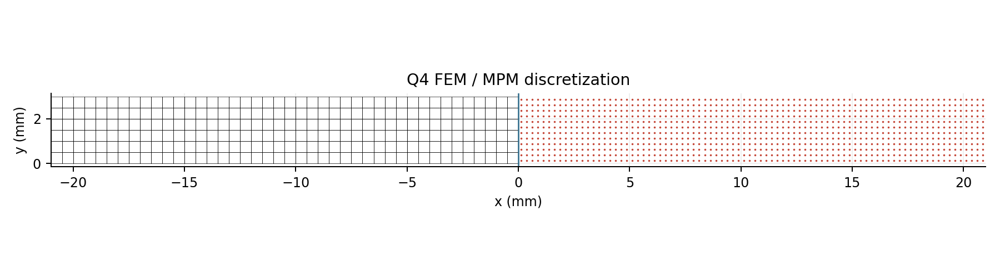
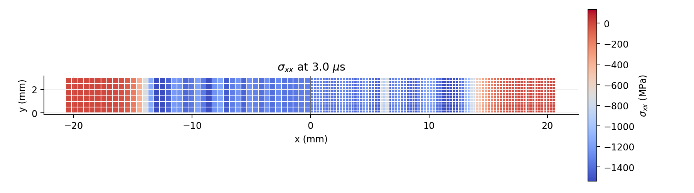

# CFEMP

Lian, Zhang & Liu (2011) 板碰撞算例的二维实现。

左板是 Q4 FEM，右板是 MPM。两套动量只在接触网格点上做法向投影，
没有把 FEM 节点和粒子塞进同一个速度场。

```bash
python -m pip install -e .
python -m cfemp.benchmark
```

默认网格：

- FEM：301 节点，252 个 Q4；
- MPM：1008 个粒子，0.5 mm 背景网格；
- 截面：\(21\text{ mm}\times3\text{ mm}\)，厚度 3 mm；
- 平面应变，\(E=65\) GPa，\(\nu=0\)，\(\rho=2750\) kg/m³；
- 两板初速度分别为 \(\pm100\) m/s。



## 结果



| 检查项 | 数值 |
|---|---:|
| 接触压应力 | -1359.23 MPa |
| 解析值 | -1336.97 MPa |
| 应力误差 | 1.66% |
| 分离时间 | 8.6800 μs |
| 解析分离时间 | 8.6389 μs |
| 最大能量误差 | 2.55% |
| 归一化动量误差 | \(1.79\times10^{-14}\) |
| 时间加密斜率 | 0.86 |

原始曲线和数值历史在
[`results/symmetric_plate_impact/`](results/symmetric_plate_impact/)。

## 检查

```bash
python -m unittest discover -s tests -v
```

测试包含 Q4 patch、MPM 仿射场、斜向法向投影、界面动量平衡、应力波、
分离时间、能量和时间步加密。

## 惩罚法

`mpm_fem/` 保留为惩罚接触对照：

```bash
python -m mpm_fem
```

它不参与论文接触算法。方法对应关系和实现边界见
[`docs/method.md`](docs/method.md)，修改记录见
[`docs/devlog.md`](docs/devlog.md)。

## Reference

Y. P. Lian, X. Zhang, Y. Liu, *Coupling of finite element method with
material point method by local multi-mesh contact method*, CMAME 200
(2011) 3482-3494. DOI: `10.1016/j.cma.2011.07.014`.
