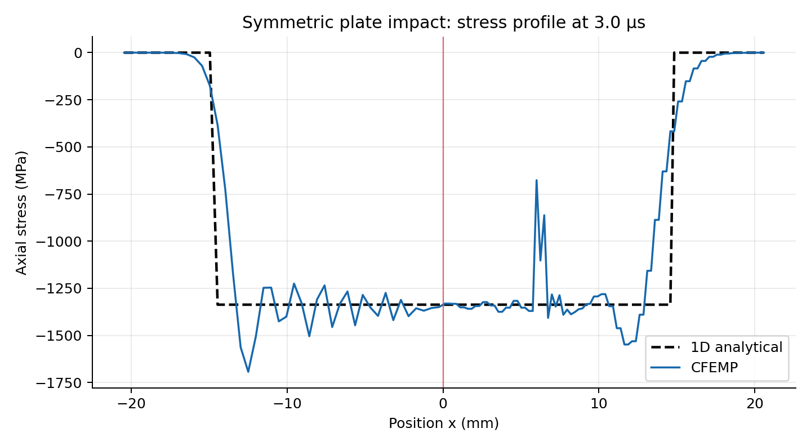
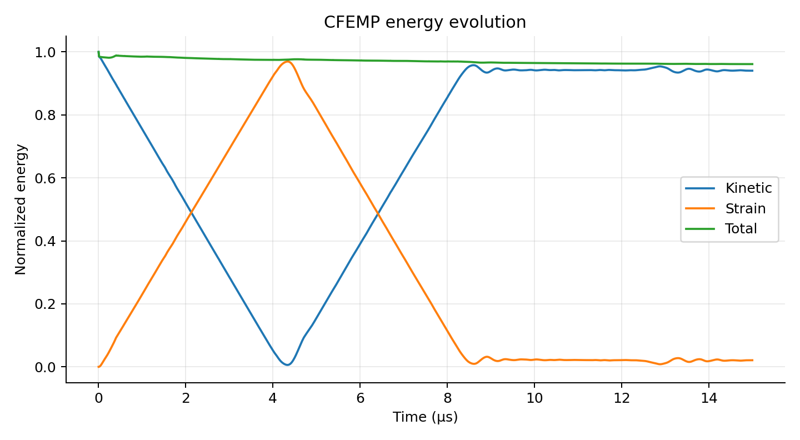
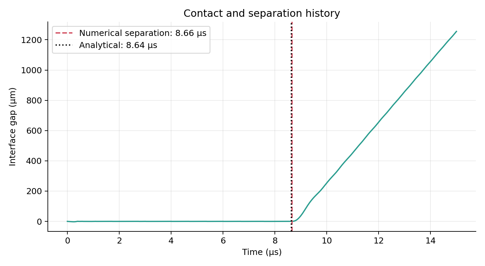
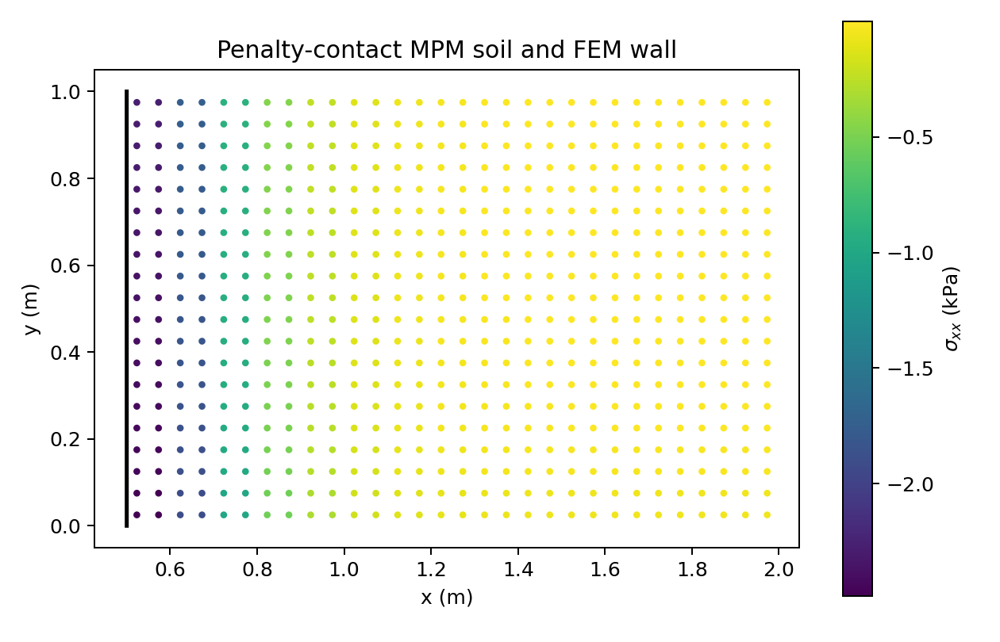

# CFEMP 论文复现

用户提供的 2018 年 CFEMP 章节是一篇方法综述。这里选用该章节参考文献 1
的原始方法论文（压缩包中的 2011 年论文）所给出的对称弹性板碰撞作为首个
可定量验收实例。

本仓库包含两条明确分离的计算路径：

1. `cfemp/`：复现 Lian、Zhang、Liu（2011）的 CFEMP 对称弹性板碰撞。
2. `mpm_fem/`：经过修正的 MPM-FEM 惩罚函数接触演示，不声称是论文原始方法。

## 复现结果

默认参数完全对应论文第 5.1 节。

| 指标 | 解析/论文值 | 本实现 | 相对误差 |
|---|---:|---:|---:|
| 接触压应力 | -1336.97 MPa | -1349.42 MPa | 0.93% |
| 分离时间 | 8.6389 μs | 8.6600 μs | 0.24% |
| 最大能量误差 | - | 3.86% | - |
| 归一化动量误差 | 0 | \(1.47\times10^{-15}\) | - |







论文参数、离散公式、两段接触冲量和验收条件见
[`docs/method.md`](docs/method.md)。

## 安装

```bash
python -m pip install -e .
```

只依赖 NumPy 和 Matplotlib，不依赖未锁定版本的 Taichi。

## 一键生成论文复现图片

```bash
python -m cfemp.benchmark
```

输出目录为 `results/symmetric_plate_impact/`，包括：

- `stress_profile_3us.png`；
- `energy_evolution.png`；
- `contact_separation.png`；
- `metrics.json`；
- `history.npz`。

## 运行惩罚接触示例

```bash
python -m mpm_fem
```

输出目录为 `results/penalty_contact/`。



## 测试

```bash
python -m unittest discover -s tests -v
```

测试覆盖：

- 形函数分片单位性；
- 惩罚力方向；
- 作用力与反作用力；
- 接触子迭代不重复累计；
- MPM 内力自平衡；
- 论文接触压应力；
- 论文分离时间；
- 总动量和总能量；
- 复现图片与历史文件生成。

## 论文来源

Y. P. Lian, X. Zhang, Y. Liu, “Coupling of finite element method with
material point method by local multi-mesh contact method,”
*Computer Methods in Applied Mechanics and Engineering*,
200 (2011), 3482-3494.

DOI: `10.1016/j.cma.2011.07.014`
